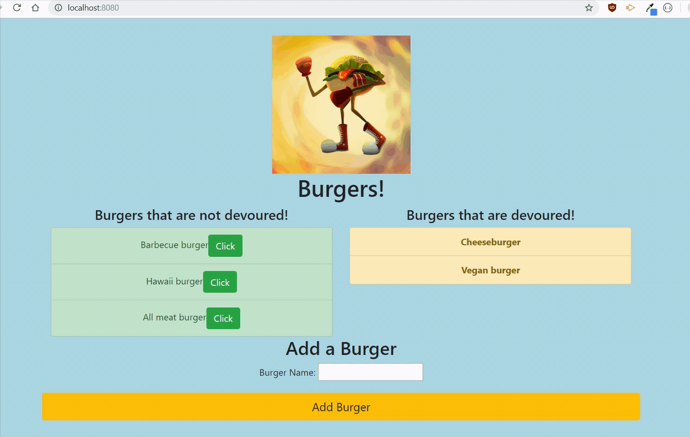

# burger

## Table of contents

- [General info](#general-info)
- [Technologies](#technologies)
- [Deployment](#Deployment)

## General info

Eat-Da-Burger! is a restaurant app that lets users input the names of burgers they'd like to eat.

## Technologies

Project is created with:

- JavaScript
- Node.js
- NPM package
- Heroku
- orm
- handlebars

## Deployment

- Clone the repo and npm install
- Portfolio link: https://elvykiung.github.io/
- App Link: https://afternoon-reaches-94783.herokuapp.com/
